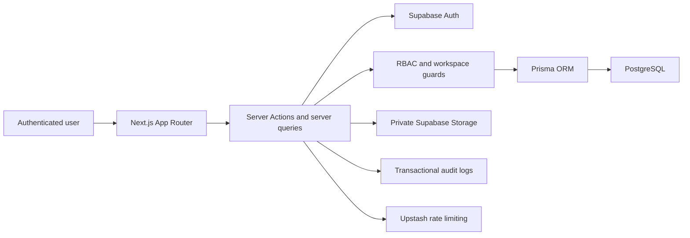

# AI Client Portal SaaS

A multi-tenant client portal for agencies and service teams to manage clients, projects, tasks, files, invitations, and workspace activity from one secure application.

Built with the Next.js App Router, TypeScript, Prisma, PostgreSQL, and Supabase. The project emphasizes practical SaaS architecture: role-based access control, workspace isolation, client-facing data boundaries, auditability, and production-oriented security controls.

## Live Demo

Live deployment: **Coming soon**

> Add the production URL here after the Vercel deployment is configured.

## Screenshots

| View | Placeholder |
| --- | --- |
| Workspace dashboard | Add `docs/screenshots/dashboard.png` |
| Projects and client delivery | Add `docs/screenshots/projects.png` |
| Task management | Add `docs/screenshots/tasks.png` |
| Admin workspace settings | Add `docs/screenshots/admin.png` |
| Audit log | Add `docs/screenshots/audit-logs.png` |

## Core Features

- Supabase authentication with workspace membership bootstrap
- Workspace-based multi-tenancy
- Role-based access control across server-rendered pages and Server Actions
- Client, project, and task management
- Client portal views scoped to the linked client profile
- Private file uploads with short-lived signed download URLs
- Workspace invitations with email delivery through Resend
- Workspace audit logs for business and admin-sensitive actions
- Admin workspace settings and member role management
- User notifications and recent activity views
- Focused rate limiting for invitations, file uploads, and admin mutations
- Production CSP and HSTS security headers

## Tech Stack

| Layer | Technologies |
| --- | --- |
| Frontend | Next.js 16 App Router, React 19, TypeScript, Tailwind CSS, shadcn/ui, Radix UI |
| Backend | Next.js Server Actions, Prisma ORM |
| Database | PostgreSQL |
| Authentication and storage | Supabase Auth, Supabase Storage |
| Validation | Zod, React Hook Form |
| Email | Resend |
| Rate limiting | Upstash Redis with a development fallback |
| Testing | Vitest, Testing Library, Playwright |
| Delivery | GitHub Actions, Vercel |

## Architecture Overview

The repository is organized by product capability. Pages remain thin while feature modules own queries, Server Actions, schemas, and components.

```text
src/
├── app/                    # App Router pages, layouts, and route segments
├── components/             # Shared layout and UI components
├── features/               # Domain modules: clients, projects, tasks, files, admin
├── lib/
│   ├── actions/            # Shared Server Action utilities
│   ├── auth/               # Current user, workspace, and client context
│   ├── db/                 # Prisma client
│   ├── permissions/        # RBAC and workspace relation guards
│   ├── security/           # Rate limiting
│   └── supabase/           # Browser, server, admin, and middleware clients
└── test/                   # Shared test setup
```



## Security Architecture

Security decisions are enforced server-side. UI visibility is not treated as an authorization boundary.

- **RBAC:** centralized permission checks protect queries and mutations.
- **Workspace isolation:** tenant-owned queries filter by the current workspace.
- **Client isolation:** `CLIENT` users only receive projects, tasks, and files linked to their own `Client` record. An unlinked client profile fails closed and receives an empty state.
- **Relational validation:** project client assignments and task assignees are checked against the active workspace before mutation.
- **Private files:** file downloads use workspace-aware ownership checks and short-lived Supabase signed URLs.
- **Transactional mutations:** database mutations and their audit log writes use `prisma.$transaction()` so audit records cannot fail independently.
- **Admin audit logs:** role changes and workspace updates record the authenticated actor and workspace.
- **Rate limiting:** invitation operations, uploads, and admin mutations are limited by authenticated user ID and action type. Upstash Redis should be configured in production; local development uses an in-memory fallback.
- **Security headers:** production responses include Content Security Policy, HSTS, clickjacking protection, MIME sniffing protection, a restrictive referrer policy, and a permissions policy.
- **Environment validation:** required configuration is validated before use.

## RBAC Roles

| Role | Primary access |
| --- | --- |
| `ADMIN` | Full workspace administration, invitations, clients, projects, tasks, files, and audit logs |
| `MANAGER` | Client and delivery management, task and file operations, and audit log visibility |
| `TEAM_MEMBER` | Project and task collaboration, file viewing, and file uploads |
| `CLIENT` | Read-only access to the linked client's own projects, tasks, and files |

## Multi-Tenancy

Each workspace is a tenant boundary. Membership records connect users to workspaces and assign a role. Clients, projects, invitations, and audit logs belong to a workspace; tasks and file uploads inherit their workspace boundary through their project.

Client portal users have an additional boundary: a `Client.portalUserId` link. Queries for the `CLIENT` role add client ownership filters and never fall back to workspace-wide data.

The current application selects the user's earliest workspace membership as the active workspace. Before supporting users who actively switch between multiple workspaces, add an explicit workspace selection mechanism and persist the selected tenant context.

## Database Models

| Model | Purpose |
| --- | --- |
| `User` | Authenticated account profile |
| `Workspace` | Tenant record with a unique slug |
| `WorkspaceMember` | User-to-workspace membership and RBAC role |
| `Client` | Workspace client profile with an optional linked portal user |
| `Project` | Workspace delivery record optionally assigned to a client |
| `Task` | Project task optionally assigned to a user |
| `FileUpload` | Private project file metadata and storage path |
| `AuditLog` | Workspace-scoped action history with actor metadata |
| `Invitation` | Expiring workspace invitation with role and status |
| `Notification` | User notification record |

## Local Setup

### Prerequisites

- Node.js 22+
- npm
- A Supabase project
- PostgreSQL connection strings from Supabase

### Installation

```bash
git clone <repository-url>
cd ai-client-portal-saas
npm install
cp .env.example .env.local
npx prisma generate
npx prisma migrate dev
npm run dev
```

Open [http://localhost:3000](http://localhost:3000).

## Environment Variables

Create `.env.local` from `.env.example`:

```env
DATABASE_URL=""
DIRECT_URL=""

NEXT_PUBLIC_SUPABASE_URL=""
NEXT_PUBLIC_SUPABASE_ANON_KEY=""
NEXT_PUBLIC_SUPABASE_STORAGE_BUCKET="project-files"
NEXT_PUBLIC_APP_URL="http://localhost:3000"

SUPABASE_SERVICE_ROLE_KEY=""

RESEND_API_KEY=""
RESEND_FROM_EMAIL="AI Client Portal <onboarding@resend.dev>"

UPSTASH_REDIS_REST_URL=""
UPSTASH_REDIS_REST_TOKEN=""
```

`DATABASE_URL` should use the Supabase transaction pooler for application traffic. `DIRECT_URL` should use a direct database connection for Prisma migration operations.

## Prisma Migrations

Generate the Prisma client:

```bash
npx prisma generate
```

Create and apply a local development migration:

```bash
npx prisma migrate dev --name describe_the_change
```

Validate and inspect migration state:

```bash
npx prisma validate
npx prisma migrate status
```

Apply committed migrations in production:

```bash
npx prisma migrate deploy
```

Do not edit migrations that may already be applied. For older populated databases blocked by the historical required `FileUpload.filePath` migration, review and run the forward-safe recovery script before resolving that migration:

```bash
psql "$DIRECT_URL" \
  -v ON_ERROR_STOP=1 \
  -f prisma/backfills/20260529115048_prepare_file_upload_metadata.sql
```

The script aborts if any legacy row cannot be mapped safely.

## Supabase Setup

1. Create a Supabase project and copy the database, project URL, anonymous key, and service role key values into `.env.local`.
2. Configure Supabase Auth redirect URLs for local development and the deployed Vercel URL.
3. Create a private Storage bucket named `project-files`, or set `NEXT_PUBLIC_SUPABASE_STORAGE_BUCKET` to the chosen private bucket name.
4. Keep `SUPABASE_SERVICE_ROLE_KEY` server-only. Never expose it through a `NEXT_PUBLIC_` variable.
5. Run Prisma migrations against the Supabase PostgreSQL database.

## Quality Commands

```bash
npm run lint          # ESLint
npm run test:run      # Vitest unit tests
npm run test:coverage # Vitest coverage
npm run test:e2e      # Playwright end-to-end tests
npm run build         # Production build
```

GitHub Actions runs linting, unit tests, and a production build on the main branch workflow. A separate pull request workflow runs Playwright.

## Docker

The production image uses the minimal Next.js standalone server and runs as a non-root user. It connects to Supabase Cloud using runtime environment variables; Docker Compose does not start a local database.

Create `.env.local` from `.env.example`, then build and run the web container:

```bash
cp .env.example .env.local
docker compose --env-file .env.local up --build
```

Open [http://localhost:3000](http://localhost:3000). Stop the container with:

```bash
docker compose down
```

Only `NEXT_PUBLIC_*` variables are passed as image build arguments because they are browser-visible by design. Database credentials, the Supabase service role key, Resend credentials, and Upstash credentials are injected when the container starts and are not copied into the image.

## Vercel Deployment

1. Import the repository into Vercel.
2. Add the production environment variables from `.env.example`.
3. Set `NEXT_PUBLIC_APP_URL` to the deployed HTTPS origin.
4. Configure the matching Supabase Auth redirect URL.
5. Run `npx prisma migrate deploy` as a controlled release step.
6. Configure Upstash Redis for distributed production rate limiting.
7. Verify the private Supabase Storage bucket and signed file downloads.
8. Confirm production responses include CSP and HSTS headers.

## Production Readiness

Implemented:

- Server-side RBAC and workspace isolation
- Client-specific portal isolation
- Workspace relation validation for sensitive assignments
- Transactional database mutations with audit log consistency
- Admin-sensitive audit events
- Private files with signed URLs
- Focused abuse protection
- CSP, HSTS, and supporting browser security headers
- CI quality checks and production build validation

Recommended before broader production use:

- Add explicit active workspace selection for multi-workspace users
- Add database-level tenant-aware relation constraints where practical
- Add durable storage reconciliation for rare database and object storage partial failures
- Expand security integration tests for tenant isolation, transaction rollback, and rate-limit exhaustion
- Add monitoring, alerting, and structured production observability

## Future Improvements

- Explicit workspace switching and workspace slug routes
- Database-enforced composite tenant relationships
- Storage cleanup and reconciliation jobs
- Expanded notification workflows
- Richer reporting and client delivery dashboards
- Additional integration and end-to-end security coverage

## Portfolio Value

This project demonstrates how to structure a realistic SaaS product beyond basic CRUD:

- Designing tenant-aware data access boundaries
- Implementing server-side RBAC and fail-closed client portal access
- Keeping business mutations and audit trails consistent
- Protecting private files with scoped signed URLs
- Applying focused rate limiting and production browser security headers
- Managing Prisma migrations safely across evolving environments
- Organizing a Next.js App Router codebase around maintainable feature modules

## License

MIT
